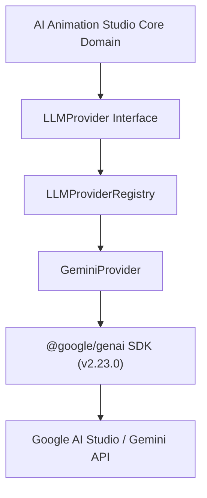

# Gemini Integration Architecture — AI Animation Studio (Phase 16.5)

## 1. Architectural Philosophy & Principle

> **Core Tenet**: Gemini is a replaceable worker, NOT the Studio product.

The core domain logic of AI Animation Studio (`StoryEngine`, `DirectorEngine`, `ContinuityQA`) remains strictly provider-neutral. It never imports `@google/genai` directly. All LLM interactions proceed through the strongly typed `LLMProvider` contract, mediated by `LLMProviderRegistry`.



---

## 2. SDK Decision & Rationale

- **SDK Chosen**: `@google/genai` (modern official unified SDK)
- **Version**: `^2.23.0`
- **Deprecated / Rejected Packages**:
  - `@google/generative-ai`: Legacy SDK deprecated by Google in favor of `@google/genai`.
  - Vertex AI / Google Cloud SDKs (`@google-cloud/*`): Strictly rejected to preserve the zero-cloud-infrastructure, local-first tenet.

---

## 3. Authentication & Credential Security

1. **Environment Variable**: `GEMINI_API_KEY`
2. **Masked Diagnostics**: Keys are never printed in plaintext in logs, terminal reports, or exceptions. Display is strictly masked as `AIza...xxxx` (preserving only the first 4 and last 4 characters) or `(not configured)`.
3. **Repository Protection**: `.gitignore` strictly excludes `.env`, `.env.local`, `.env.*.local`, and `*.env`.
4. **Safety Enforcement**:
   - `MOCK` mode: Simulated LLM allowed for testing; all outputs tagged mock.
   - `LOCAL` mode: Gemini is optional. If unconfigured, pipeline falls back to deterministic rule-based engines with `NOT_CONFIGURED` status.
   - `PRODUCTION` mode: If Gemini is explicitly selected and `GEMINI_API_KEY` is missing, `ProductionSafetyError` is thrown. Mock fallback is forbidden.

---

## 4. Centralized Model Policy & Role-Based Routing

Hardcoded model strings are strictly prohibited throughout the application. All model selection passes through `ModelPolicy` with role-based routing and environment overrides:

| Conceptual Role | Default Gemini Model | Environment Variable Override | Purpose |
|---|---|---|---|
| `FAST` | `gemini-2.5-flash` | `GEMINI_MODEL_FAST` | Low-latency ping, health checks, simple summarization |
| `REASONING` | `gemini-2.5-pro` | `GEMINI_MODEL_REASONING` | In-depth story analysis, character psychological beats, directorial blocking |
| `STRUCTURED` | `gemini-2.5-flash` | `GEMINI_MODEL_STRUCTURED` | High-fidelity schema-constrained candidate entity extraction |
| `QA` | `gemini-2.5-flash` | `GEMINI_MODEL_QA` | Semantic continuity checks, source fidelity audits |

---

## 5. Structured Output & Schema Validation

AI Animation Studio never parses unstructured prose when structured entities are expected.

```
Zod Domain Schema
       ↓
convertZodToJsonSchema()
       ↓
OpenAPI 3.0 / Gemini responseSchema
       ↓
Gemini API execution (responseMimeType: 'application/json')
       ↓
Raw JSON text parsed
       ↓
Zod Safe Parse & Domain Constraints Checked
       ↓
Type-safe Validated Domain Entity
```

Validation guarantees:
- Enums (`timeOfDay`, `shotSize`, `angle`, `purpose`) are checked against domain types.
- Missing required fields immediately raise `StudioError` (`SCHEMA_VALIDATION_FAILED`).
- Extracted entities are treated as **Candidates** (`CharacterCandidate`, `LocationCandidate`, `PropCandidate`), never mutating canonical universe state without human approval.

---

## 6. Source Preservation Rules

Prompts enforce strict source fidelity contracts:
- `preserve_meaning = STRICT`
- `preserve_facts = STRICT`
- `narration.rewrite = false`
- `dialogue.rewrite = false`
- `allow_visual_interpretation = true`
- `allow_scene_split = true`
- `allow_shot_creation = true`
- `allow_remove_content = false`
- `allow_add_story_events = false`

Every extracted beat, line of dialogue, and candidate contains character-level `SourceTraceability` offsets pointing back to the original `SourceDocument`.

---

## 7. Rate Limiting, Retry & Backoff Strategy

- **Error Classification**:
  - `AUTH_ERROR` (401, 403, invalid key) → Non-retryable, immediate explicit fail.
  - `RATE_LIMITED` (429, rate limit exceeded) → Bounded exponential backoff with jitter.
  - `QUOTA_EXCEEDED` (daily quota exhausted) → Non-retryable without quota reset.
  - `TIMEOUT` (deadline exceeded) → Retryable up to max retries.
  - `SCHEMA_VALIDATION_FAILED` / `SAFETY_BLOCK` → Never retried blindly with identical input.
- **Retry Defaults**:
  - `maxRetries`: 3
  - `initialBackoffMs`: 500ms
  - `maxBackoffMs`: 4000ms
  - `jitter`: Random 0-200ms

---

## 8. Free-Tier-First Policy & Caching

1. **Deterministic First**: If a task does not require LLM reasoning, deterministic rule-based algorithms run at 0 cost and 0 latency.
2. **Series-Isolated Cache (`LLMCache`)**:
   - Cache keys are computed via SHA-256 over: provider, model, task type, system instruction, prompt content, prompt version, schema version, and `seriesId`.
   - Keys are strictly scoped by `seriesId`. A cached result for Series A can never be returned for Series B.
3. **Usage Accounting**:
   - Tracks `promptTokens`, `completionTokens`, `totalTokens`, `cachedTokens`, `latencyMs`, and `costStatus: 'FREE_TIER'`.
   - Never fabricates imaginary monetary savings or percentages.
