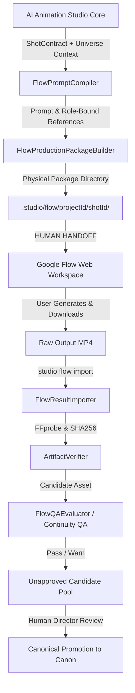

# Google Flow Production Bridge Architecture

## 1. Overview & Architectural Boundaries

Google Flow is an external generative video rendering workspace and tool. It is **NOT** the canonical story engine, character owner, universe database, or QA authority of AI Animation Studio.

Canonical truth, character DNA, scene continuity, source text hashes, and editorial timelines reside exclusively inside **AI Animation Studio**.



## 2. Integration Mode: ASSISTED

- **Default & Only Authorized Mode**: `ASSISTED`
- **Automation API**: `UNSUPPORTED / NOT CONFIGURED`
- **Security & Integrity Policy**:
  - AI Animation Studio strictly **NEVER** scrapes private Google Flow endpoints.
  - Studio **NEVER** captures cookies, sessions, OAuth tokens, or Google account credentials.
  - Studio **NEVER** attempts unofficial browser automation on Flow web interfaces.
  - When an official public Google Flow developer API is released and documented by Google, the studio can evaluate an `API_AUTOMATED` adapter. Until then, any automated execution is strictly prohibited.

## 3. Flow Job State Machine

All Flow shots follow an explicit, non-bypassable state machine:

```
DRAFT
  ↓
PACKAGE_READY
  ↓
NEEDS_USER_ACTION (Studio halts and guides human creator)
  ↓
WAITING_FOR_IMPORT
  ↓
IMPORTED
  ↓
VERIFYING (ArtifactVerifier + FFprobe stream inspection)
  ↓
VERIFIED
  ↓
QA_PENDING (Continuity & hallucination evaluation)
  ↓
(CANDIDATE | QA_FAILED)
  ↓
(APPROVED | REJECTED)
```

Illegal transitions (such as `WAITING_FOR_IMPORT -> APPROVED` directly) throw `StudioError(FLOW_ILLEGAL_STATE_TRANSITION)` and fail execution.

## 4. Semantic Reference Role Model

External generative video models suffer from severe identity drift if supplied with arbitrary unannotated images. The Flow Bridge introduces explicit semantic reference roles:

- `CHARACTER_IDENTITY`: Turnaround sheets and facial anchors defining persistent persona.
- `CHARACTER_OUTFIT`: Wardrobe guidelines and color palettes.
- `CHARACTER_POSE`: Starting actor staging and pose keyframes.
- `LOCATION`: Architectural plates, lighting conditions, and landmarks.
- `PROP`: Discrete interaction objects (e.g. candle, white butterfly).
- `STYLE`: Color grading and rendering aesthetics.
- `FIRST_FRAME`: Strict opening keyframe candidate.
- `LAST_FRAME`: Strict concluding keyframe candidate.

## 5. Flow Prompt Compiler

`FlowPromptCompiler` translates provider-neutral `ShotContract` fields into structured Flow directives:
- `[SUBJECT]`: Actor identity anchored to canonical reference IDs.
- `[ACTION]`: Natural language description of character action and beats.
- `[ENVIRONMENT]`: Scene setting and architectural constraints.
- `[CAMERA]`: Camera movement, angles, and translated semantic skills (`/pushin`, `/orbit`, `/slowmo`).
- `[COMPOSITION]`: Framing rules and placement.
- `[MOTION]`: Physical movement constraints.
- `[LIGHTING]`: Mood, key light vector, and color temperature.
- `[CONTINUITY]`: Identity and spatial persistence requirements.
- `[REFERENCE USAGE]`: Clear mapping of uploaded references to roles.
- `[DO NOT CHANGE]`: Negative prompt constraints (preserves user locks, blocks character swapping or hallucinated narrative events).

## 6. Result Importer, Verification & Candidate Promotion

- **Physical Media Verification**: Every imported video is inspected with `ArtifactVerifier` and `FFprobe`. Zero-byte files, non-video containers, or corrupt streams are immediately rejected.
- **Candidate Status**: Imported media is enrolled into `IAssetRegistry` with `status: 'candidate'`. It cannot be used in production timelines until human review.
- **Continuity QA Gate**: `FlowQAEvaluator` checks duration fidelity, codec compliance, and scans notes for unsupported/hallucinated events. Any `CRITICAL` issue transitions the job to `QA_FAILED` and blocks approval.
- **Versioned Iteration**: Re-rendering a shot creates version increments (`v1`, `v2`, etc.), preserving historical candidates for audit without silently overwriting canon.
