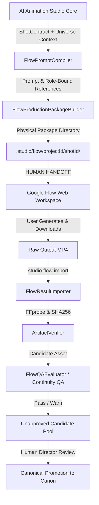

# Google Flow Production Bridge Architecture

## 1. Overview & Architectural Boundaries

Google Flow is an external generative video rendering workspace and tool. It is **NOT** the canonical story engine, character owner, universe database, or QA authority of AI Animation Studio.

Canonical truth, character DNA, scene continuity, source text hashes, and editorial timelines reside exclusively inside **AI Animation Studio**.



## 2. Integration Mode: ASSISTED

- **Default & Only Authorized Mode**: `ASSISTED`
- **Automation API**: `UNSUPPORTED / NOT CONFIGURED`
- **Security & Integrity Policy**:
  - AI Animation Studio strictly **NEVER** scrapes private Google Flow endpoints.
  - Studio **NEVER** captures cookies, sessions, OAuth tokens, or Google account credentials.
  - Studio **NEVER** attempts unofficial browser automation on Flow web interfaces.
  - When an official public Google Flow developer API is released and documented by Google, the studio can evaluate an `API_AUTOMATED` adapter. Until then, any automated execution is strictly prohibited.

## 3. Flow Job State Machine

All Flow shots follow an explicit, non-bypassable state machine:

```
DRAFT
  ↓
PACKAGE_READY
  ↓
NEEDS_USER_ACTION (Studio halts and guides human creator)
  ↓
WAITING_FOR_IMPORT
  ↓
IMPORTED
  ↓
VERIFYING (ArtifactVerifier + FFprobe stream inspection)
  ↓
VERIFIED
  ↓
QA_PENDING (Continuity & hallucination evaluation)
  ↓
(CANDIDATE | QA_FAILED)
  ↓
(APPROVED | REJECTED)
```

Illegal transitions (such as `WAITING_FOR_IMPORT -> APPROVED` directly) throw `StudioError(FLOW_ILLEGAL_STATE_TRANSITION)` and fail execution.

## 4. Semantic Reference Role Model

External generative video models suffer from severe identity drift if supplied with arbitrary unannotated images. The Flow Bridge introduces explicit semantic reference roles:

- `CHARACTER_IDENTITY`: Turnaround sheets and facial anchors defining persistent persona.
- `CHARACTER_OUTFIT`: Wardrobe guidelines and color palettes.
- `CHARACTER_POSE`: Starting actor staging and pose keyframes.
- `LOCATION`: Architectural plates, lighting conditions, and landmarks.
- `PROP`: Discrete interaction objects (e.g. candle, white butterfly).
- `STYLE`: Color grading and rendering aesthetics.
- `FIRST_FRAME`: Strict opening keyframe candidate.
- `LAST_FRAME`: Strict concluding keyframe candidate.

## 5. Flow Prompt Compiler

`FlowPromptCompiler` translates provider-neutral `ShotContract` fields into structured Flow directives:
- `[SUBJECT]`: Actor identity anchored to canonical reference IDs.
- `[ACTION]`: Natural language description of character action and beats.
- `[ENVIRONMENT]`: Scene setting and architectural constraints.
- `[CAMERA]`: Camera movement, angles, and translated semantic skills (`/pushin`, `/orbit`, `/slowmo`).
- `[COMPOSITION]`: Framing rules and placement.
- `[MOTION]`: Physical movement constraints.
- `[LIGHTING]`: Mood, key light vector, and color temperature.
- `[CONTINUITY]`: Identity and spatial persistence requirements.
- `[REFERENCE USAGE]`: Clear mapping of uploaded references to roles.
- `[DO NOT CHANGE]`: Negative prompt constraints (preserves user locks, blocks character swapping or hallucinated narrative events).

## 6. Result Importer, Verification & Candidate Promotion

- **Physical Media Verification**: Every imported video is inspected with `ArtifactVerifier` and `FFprobe`. Zero-byte files, non-video containers, or corrupt streams are immediately rejected.
- **Candidate Status**: Imported media is enrolled into `IAssetRegistry` with `status: 'candidate'`. It cannot be used in production timelines until human review.
- **Continuity QA Gate**: `FlowQAEvaluator` checks duration fidelity, codec compliance, and scans notes for unsupported/hallucinated events. Any `CRITICAL` issue transitions the job to `QA_FAILED` and blocks approval.
- **Versioned Iteration**: Re-rendering a shot creates version increments (`v1`, `v2`, etc.), preserving historical candidates for audit without silently overwriting canon.

## 7. Persistent Flow Job Storage (`StorageFlowJobRepository`)

Flow job records are not memory-only. They are physically persisted to the Studio's storage root using `IFlowJobRepository` backed by `IStorageProvider`:
- Physical location: `.studio/flow/jobs/<jobId>.json`
- Persistence transitions: State is committed to disk at every lifecycle transition (`DRAFT`, `PACKAGE_READY`, `NEEDS_USER_ACTION`, `WAITING_FOR_IMPORT`, `IMPORTED`, `VERIFYING`, `VERIFIED`, `QA_PENDING`, `CANDIDATE`, `QA_FAILED`, `APPROVED`, `REJECTED`, `ARCHIVED`).
- Atomic writes: Uses atomic temp file writing (`.tmp` + rename) supported by `FileSystemStorage` to prevent partial or corrupted JSON.

## 8. Restart Recovery & Collision-Safe Versioning

- **Restart Recovery**: If the Studio process terminates while a job is in `NEEDS_USER_ACTION` or `CANDIDATE`, a new `FlowJobManager` instance reloads the exact job state from disk.
- **Persistent Version History**: Next version generation queries disk history (`findByShot`). A restarted process generates `v2` (or `v3`) rather than resetting to `v1`.
- **Collision Protection**: Version allocation checks both disk state and in-memory caches, retrying with incremented versions to avoid overwriting existing files.
- **Series/Project Scoping**: Jobs are strictly scoped by `projectId`, `seriesId`, and `shotId`. `SHOT_001` in Series A cannot collide with `SHOT_001` in Series B.

## 9. Canonical Semantic Package Hashing

Flow packages calculate a deterministic SHA-256 semantic package digest via `computePackageSemanticHash`:
- **Included Semantic Inputs**: `shotContractSnapshot`, `sourceReferences`, `references`, `firstFrame`, `lastFrame`, `continuityConstraints`, `styleGuidelines`, `explicitWorkflow`, `modelRecommendation`.
- **Canonical Key Ordering**: Deep recursive sorting of object keys guarantees identical hashes regardless of serialization order.
- **Excluded Volatile Properties**: Timestamps (`createdAt`, `timestamp`), temporary file paths, and runtime IDs are excluded so package identity reflects only creative content.

## 10. Import Failure Atomicity

If media import or FFprobe verification fails (e.g., corrupt MP4, zero-byte file, missing video track):
- The job is **never** left in a falsely reporting `VERIFIED` state.
- The job state is safely reverted to `WAITING_FOR_IMPORT` with diagnostic metadata (`lastError`, `lastAttemptAt`, `failureCode`).
- Previous valid candidates are preserved.

## 11. Approval Artifact Re-Verification

Before a candidate is promoted (`CANDIDATE -> APPROVED`):
- The physical artifact on disk is re-verified for existence, readability, non-zero size, and SHA-256 checksum integrity.
- If the artifact originally passed video stream verification, `ArtifactVerifier` re-verifies that a valid video stream is present. If the candidate file disappeared or became corrupted post-import, approval is strictly blocked (`FLOW_CANDIDATE_ARTIFACT_INVALID`).

## 12. Financial Claim Reality & Transparency

- **Untracked / Unknown Costs**: When credit usage is not specified by the user during import, cost is classified strictly as `UNKNOWN`, not zero.
- **Estimated Benchmarks**: Financial metrics comparing deterministic vs generative routing are labeled as `ESTIMATED BENCHMARK`.
- **Zero Fabrication**: Unsupported percentage claims (e.g. hardcoded 75.4%) are completely eliminated from production CLI and UI displays.

## 13. QA Scope & Phase 17 Deferred Scope

Current `FlowQAEvaluator` performs deterministic, metadata, and heuristic QA (temporal bounds, container conformance, hallucination keyword scanning).
> [!NOTE]
> Visual semantic continuity QA (cross-shot character feature embeddings, facial landmark matching, and spatial perspective QA) is explicitly deferred to **Phase 17**. Current evaluation is deterministic metadata QA and does not overclaim multimodal visual certainty.
