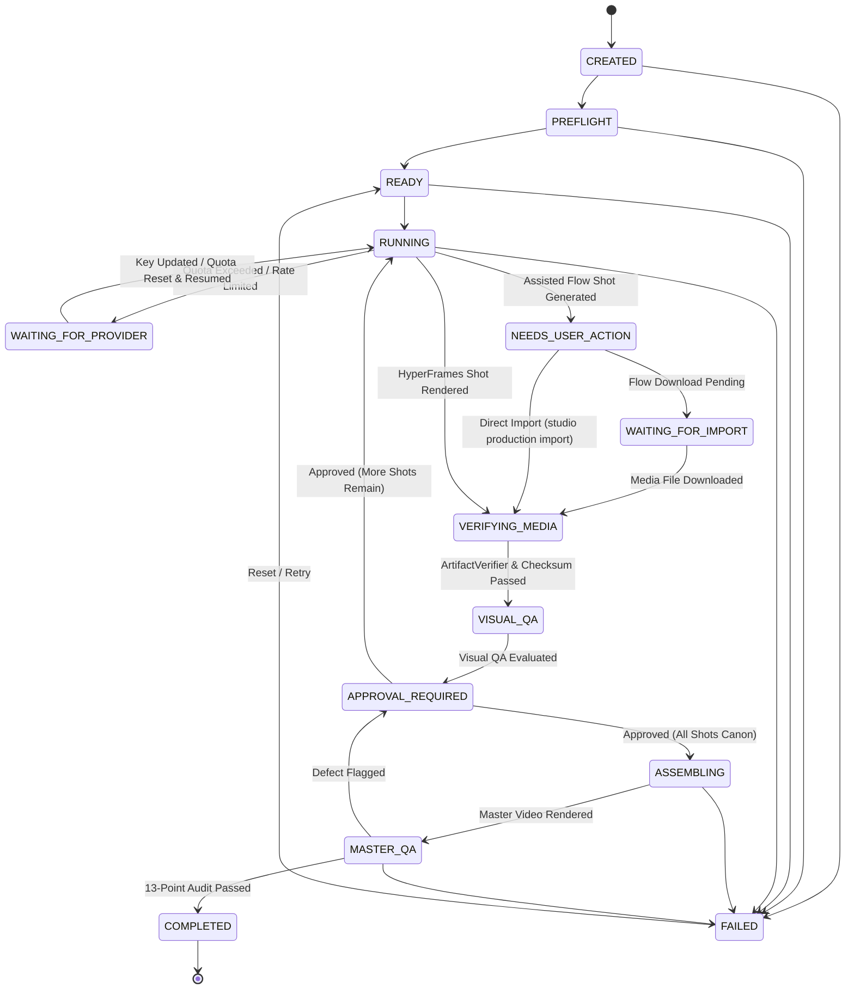

# Production Run Domain & Lifecycle Architecture

## 1. Overview & Architectural Purpose

In Phase 18, AI Animation Studio transitions from offline static contract validation to an active, resumable real-production execution system. At the center of this transition is the **ProductionRun** domain entity.

A ProductionRun tracks the physical lifecycle of an animation delivery from script ingestion to 13-point verified master export. It guarantees:
1. **Resumability**: Any interruption (quota limits, user action, process restarts) can be resumed without re-generating previously approved shots.
2. **Fail-Closed Transitions**: State transitions are verified by a strict transition matrix; illegal state jumps throw a `ProductionSafetyError`.
3. **Truthful Evidence Auditing**: Provider requests, real physical media metrics (SHA-256, ffprobe streams), QA evaluation scores, and human approval signatures are stored durably and immutably in `.studio/production/<projectId>/<runId>/`.

---

## 2. 15-State Production Run Lifecycle



### State Definitions
| State | Description | Next Permitted States |
| :--- | :--- | :--- |
| `CREATED` | Initial entity initialization. | `PREFLIGHT`, `FAILED`, `CANCELLED` |
| `PREFLIGHT` | Environmental and toolchain validation (FFmpeg, FFprobe, storage paths). | `READY`, `FAILED`, `CANCELLED` |
| `READY` | Ready for pipeline execution start. | `RUNNING`, `FAILED`, `CANCELLED` |
| `RUNNING` | Active execution (story parsing, shot planning, routing, rendering). | `WAITING_FOR_PROVIDER`, `NEEDS_USER_ACTION`, `WAITING_FOR_IMPORT`, `VERIFYING_MEDIA`, `VISUAL_QA`, `APPROVAL_REQUIRED`, `ASSEMBLING`, `FAILED`, `CANCELLED` |
| `WAITING_FOR_PROVIDER` | Provider quota exceeded (`RESOURCE_EXHAUSTED` / 429). Work preserved. | `RUNNING`, `FAILED`, `CANCELLED` |
| `NEEDS_USER_ACTION` | Assisted tool handoff (e.g. Google Flow package ready). Awaiting user clip generation. | `WAITING_FOR_IMPORT`, `VERIFYING_MEDIA`, `RUNNING`, `FAILED`, `CANCELLED` |
| `WAITING_FOR_IMPORT` | Flow package ready, awaiting downloaded MP4 deliverable. | `VERIFYING_MEDIA`, `NEEDS_USER_ACTION`, `FAILED`, `CANCELLED` |
| `VERIFYING_MEDIA` | Physical media file inspection via FFprobe, SHA-256 calculation, leak detection. | `VISUAL_QA`, `WAITING_FOR_IMPORT`, `FAILED`, `CANCELLED` |
| `VISUAL_QA` | Automated multimodal visual semantic evaluation (4 pillars: identity, spatial, defect, continuity). | `APPROVAL_REQUIRED`, `WAITING_FOR_PROVIDER`, `NEEDS_USER_ACTION`, `FAILED`, `CANCELLED` |
| `APPROVAL_REQUIRED` | Director / Human review gate. Candidate != Canon. Approval requires passing QA. | `ASSEMBLING`, `RUNNING`, `NEEDS_USER_ACTION`, `FAILED`, `CANCELLED` |
| `ASSEMBLING` | Multi-track timeline assembly, audio stems mix, and final video rendering. | `MASTER_QA`, `FAILED`, `CANCELLED` |
| `MASTER_QA` | 13-point master deliverable verification gate. | `COMPLETED`, `APPROVAL_REQUIRED`, `FAILED`, `CANCELLED` |
| `COMPLETED` | Verified master deliverable delivered. Terminal state. | None |
| `FAILED` | Process error. Preserves stage and diagnostics. Can be retried to `READY`. | `READY`, `PREFLIGHT` |
| `CANCELLED` | User cancelled execution. Terminal state. | None |

---

## 3. Evidence Store Organization

Production evidence is durable, machine-readable, and validated via Zod schemas:

```
.studio/production/<projectId>/<runId>/
├── production-run.json       # Full run metadata, stage, resume instructions
├── provider-evidence.json    # Sanitized provider calls, hashes, latency, token usage
├── media-evidence.json       # Physical media metrics (SHA-256, ffprobe, codecs, dimensions)
├── qa-evidence.json          # Visual semantic QA reports, defect logs, retake recommendations
├── approval-evidence.json    # Human sign-off decisions and canonical asset promotions
├── master-evidence.json      # 13-point audit verification certificate and master checksum
├── source_story.txt          # Original lossless source story
├── planned_shots.json        # Shot contracts planned for the production run
└── master/
    └── master.mp4            # Final verified master video deliverable
```

---

## 4. Quota-Aware Execution & Resume Flow

When live external providers (e.g. Gemini 3.5 Flash) return `RESOURCE_EXHAUSTED` or HTTP 429:
1. The provider error is classified as `QUOTA_EXCEEDED` or `RATE_LIMITED`.
2. The Studio **does not fail** with an application crash or generate mock results.
3. The run status transitions to `WAITING_FOR_PROVIDER`.
4. Completed shots and evidence remain persisted and untouched on disk.
5. Resume metadata records the exact blocked reason and resume command:
   ```bash
   studio production resume <runId>
   ```
6. When quota is reset or a new key is provided, the run resumes from the exact blocked stage without re-running completed shots.

---

## 5. Strict Media Authority Chain

In PRODUCTION mode, media must traverse an auditable, unbroken chain:

```
ShotContract
  ↓
HyperFrames / Flow Assisted Generation
  ↓
Physical Media File on Disk
  ↓
ProductionLeakDetector (Blocks test fixtures & smoke artifacts)
  ↓
ArtifactVerifier (Non-zero bytes, valid container, playable video stream)
  ↓
SHA-256 & FFprobe Extraction (Dimensions, duration, FPS, codecs)
  ↓
Candidate Asset Registered (Candidate != Canon)
  ↓
Visual Semantic QA Evaluation (Must pass without critical defects)
  ↓
Human Approval Boundary (Director sign-off)
  ↓
Promoted to Canon (CANON_<shotId>)
  ↓
Authoritative shotVideoMap
  ↓
Master Timeline Assembly
  ↓
13-Point Production Master Gate
  ↓
MASTER_PRODUCTION_VERIFIED Deliverable
```
