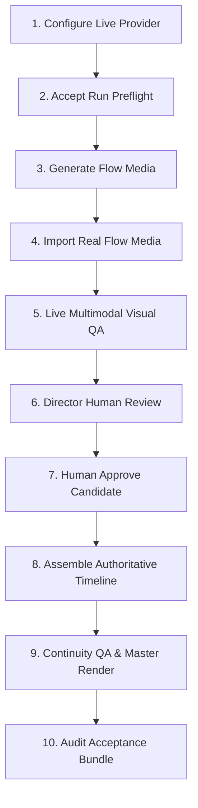

# Real Production Acceptance Guide

## Overview

This guide defines the operator workflow for achieving genuine **`MASTER_PRODUCTION_VERIFIED`** status through the Phase 18.2 Production Acceptance Harness.

The production acceptance harness enforces strict **semantic truth**, cryptographic evidence binding, and anti-spoofing constraints. Under these rules:
- **Offline test doubles and mocks are rejected** for production acceptance.
- **Simulated Flow media (`SIMULATED_FLOW`) is rejected** for production master verification.
- **Real Google Flow media requires explicit operator provenance acknowledgement** (`--source google-flow --real-external`).
- **Human approval is strictly mandatory** for every shot; automated scripts cannot spoof `HUMAN` approval.
- **Media modifications invalidate previous approvals and QA** (cryptographic SHA-256 binding).
- A durable **Acceptance Bundle** with a tamper-evident cryptographic manifest is generated and audited.

---

## 10-Step Operator Acceptance Workflow



### Summary of Operating Boundaries

| Step | Operation | Boundary Type | Automation Allowed? |
| :--- | :--- | :--- | :--- |
| **Step 1** | Configure Provider & Health | `[PROVIDER QUOTA]` | Automated preflight |
| **Step 2** | Start Acceptance Run | `[SYSTEM]` | CLI orchestrator |
| **Step 3** | Google Flow Generation | `[GOOGLE FLOW]` + `[HUMAN ACTION]` | **NO** (Manual browser/app) |
| **Step 4** | Import External Media | `[HUMAN ACTION]` | CLI with `--real-external` |
| **Step 5** | Live Multimodal QA | `[PROVIDER QUOTA]` | Automated live evaluation |
| **Step 6** | Visual Defect Review | `[HUMAN ACTION]` | **NO** (Human inspection) |
| **Step 7** | Director Human Approval | `[HUMAN ACTION]` | **NO** (Explicit `--human`) |
| **Step 8** | Timeline Assembly | `[SYSTEM]` | Automated (FFmpeg) |
| **Step 9** | Continuity QA & Master Verifier | `[SYSTEM]` + `[PROVIDER QUOTA]` | Automated 18-point gate |
| **Step 10** | Acceptance Bundle Audit | `[HUMAN ACTION]` | Cryptographic verification |

---

### Step 1: Configure Live Provider `[PROVIDER QUOTA]`

Before initiating genuine production acceptance, set your API key and opt in to live provider calls:

```powershell
# Windows PowerShell
$env:GEMINI_API_KEY = "your-live-gemini-api-key"
$env:RUN_LIVE_PROVIDER_TESTS = "true"
```

Verify provider readiness:
- Provider trust level must be **`LIVE_EXTERNAL`**.
- Model must support multimodal image input, structured JSON output, and the **`VISION_QA`** role (e.g. `gemini-2.5-pro` or `gemini-3.5-flash`).
- Offline doubles, mocks, or unconfigured providers will fail closed during preflight.

---

### Step 2: Start or Resume Production Acceptance `[SYSTEM]`

Launch the guided acceptance workflow:

```bash
studio production accept <runId> --live
```

If the run does not exist yet, create it:
```bash
studio production create story.txt --project proj_pilot --series series_s1 --mode PRODUCTION
```

The acceptance harness runs preflight, verifies provider health, checks planned shots, and advances to the first shot needing generation or import.

If provider quota is exceeded (HTTP 429 / `RESOURCE_EXHAUSTED`), the run transitions to **`WAITING_FOR_PROVIDER`**. Completed shots and evidence are preserved. Simply rerun `studio production accept <runId>` when quota resets.

---

### Step 3: Generate Real Media in Google Flow `[GOOGLE FLOW]` `[HUMAN ACTION]`

When the director/orchestrator routes a shot to Google Flow:
1. The studio compiles the shot context package into `.studio/flow/<projectId>/<shotId>/`.
2. The run transitions to **`NEEDS_USER_ACTION`** / **`WAITING_FOR_IMPORT`**.
3. **Open Google Flow in your web browser**:
   - Paste the compiled prompt.
   - Upload the canonical character/location references from the package.
   - Generate the video clip using Flow's generative models.
4. Download the final rendered MP4 to your workstation (e.g. `C:\Renders\shot_01_flow.mp4`).

---

### Step 4: Import Media with Explicit Provenance `[HUMAN ACTION]`

Import the downloaded video file into the studio production run. You must explicitly specify `--source google-flow` and `--real-external` to acknowledge genuine external provenance:

```bash
studio production import <runId> SHOT_01 C:\Renders\shot_01_flow.mp4 --source google-flow --real-external
```

**Safety Rule**:
- The CLI **never** infers `GOOGLE_FLOW_REAL` from filenames.
- Without `--real-external`, the import fails closed.
- `SIMULATED_FLOW` media is strictly segregated and cannot be upgraded to real Flow media.

The import verifies container integrity via FFprobe, calculates the physical SHA-256 checksum, and records media evidence.

---

### Step 5: Live Multimodal Visual QA `[PROVIDER QUOTA]`

Upon media import or render completion, the orchestrator automatically triggers Visual Semantic QA using the configured `LIVE_EXTERNAL` provider:

- **Integrity**: Physical container & codec verification.
- **Identity Consistency**: Frame-by-frame character DNA validation.
- **Temporal Artifacts**: Video morphing, jitter, and flickering detection.
- **Acting & Action**: Semantic verification of shot contract action description.

All four semantic coverage dimensions must be **`VERIFIED`**. `NOT_EVALUATED` or synthetic coverage will block the production master gate.

---

### Step 6: Director Human Review `[HUMAN ACTION]`

Check the visual QA report and inspect the video file:

```bash
studio production status <runId>
```

Inspect QA defects and continuity scores:
```bash
studio production evidence <runId>
```

Review the physical video on your monitor to ensure aesthetic alignment with directorial intent.

---

### Step 7: Director Human Approval `[HUMAN ACTION]`

If the candidate meets production standards, grant human approval:

```bash
studio production approve <runId> SHOT_01 --human --actor "Lead Director" --notes "Cinematography and acting approved"
```

**Approval Challenge Ceremony & Anti-Spoofing Rules**:
1. When `--human` is invoked in an interactive terminal, the orchestrator generates a single-use, time-bounded **approval challenge** cryptographically bound to `(runId, projectId, shotId, candidateAssetId, mediaSha256, qaReportId)`.
2. The CLI displays the candidate asset details, media SHA-256, QA report ID, and a random challenge nonce (e.g. `B9C8E7F01234`), prompting the operator:
   ```
   Type "APPROVE <nonce>" to confirm human approval:
   ```
3. The orchestrator strictly validates that the challenge matches the current shot, unexpired, unused, and matches the exact current physical media disk SHA-256 and QA report ID before marking the challenge consumed.
4. Programmatic calls or non-interactive scripts setting boolean `interactive=true` or passing forged confirmation objects are blocked; automated test runs record `AUTOMATED_TEST`.
5. **If media changes on disk or is re-imported after challenge issuance or approval**, previous challenges and approvals are automatically **INVALIDATED**. Re-QA and re-approval are required.

To reject a shot and trigger a retake:
```bash
studio production reject <runId> SHOT_01 --reason "Character expression too subdued; regenerate with high intensity"
```

---

### Step 8: Multi-Track Timeline Assembly `[SYSTEM]`

Once all required shots are approved into Canon, the orchestrator assembles the master timeline:
- Video Track (V1) binds exclusively to approved canonical media.
- Audio Stems (Dialogue A1, Music A2, SFX A3) are aligned.
- The timeline media checksums are verified against the approved canonical checksums. Any mismatch fails closed immediately.

---

### Step 9: Continuity QA & Master Verification `[SYSTEM]` `[PROVIDER QUOTA]`

The final master video is rendered and verified against the **18-Point Production Gate**:

1. Authoritative media exists for all required shots
2. Physical media files exist on disk
3. Physical media passes `ArtifactVerifier`
4. Cryptographic SHA-256 checksums match disk
5. Zero test/smoke/fixture media leakage
6. All candidate shots approved into Canon
7. Every shot has **`HUMAN`** approval
8. Approval checksum strictly matches current media
9. Zero `SIMULATED_FLOW` media in production
10. Timeline uses approved canonical media
11. Visual QA passed and defect-free
12. QA checksum strictly matches media and approval
13. Visual semantic coverage evaluated & verified
14. Continuity QA passed with zero critical defects
15. Zero pending retakes
16. Final master video physically exists
17. Final master has valid video stream (FFprobe audited)
18. Final acceptance bundle passes cryptographic verification

---

### Step 10: Inspect Acceptance Bundle `[HUMAN ACTION]`

Upon verification, the durable acceptance bundle is generated at:
```
.studio/production/<projectId>/<runId>/acceptance/
├── production-acceptance.json
├── provider-evidence.json
├── media-evidence.json
├── qa-evidence.json
├── approval-evidence.json
├── continuity-evidence.json
├── master-evidence.json
└── acceptance-manifest.json
```

Validate the acceptance bundle independently:
```bash
studio production verify <runId>
```

The `acceptance-manifest.json` contains cryptographic SHA-256 digests of all 7 evidence files. This integrity checksum verification guarantees detection of accidental or subsequent modification of bundled files when the manifest is authoritative. (Integrity checksums provide tamper-evidence against file tampering, while an entity with full write access to regenerate the entire directory could recompute hashes; asymmetric digital signing can be added if external third-party non-repudiation is required).

---

## Production Status Matrix Reference

When running `studio production status <runId>`, a concise 8-field matrix is displayed:

```
============================================================
🎬 PRODUCTION ACCEPTANCE STATUS: run_20260923_pilot
============================================================
Project / Series : proj_pilot / series_s1
Overall Status   : APPROVAL_REQUIRED
Execution Mode   : PRODUCTION

[1] LIVE PROVIDER       : VERIFIED (Gemini 2.5 Pro - LIVE_EXTERNAL)
[2] REAL FLOW MEDIA     : 1/1 VERIFIED (GOOGLE_FLOW_REAL)
[3] VISUAL QA           : 1/1 PASS (100% evaluated, 0 defects)
[4] HUMAN APPROVAL      : 0/1 PENDING (Shot "SHOT_01" awaits review)
[5] CONTINUITY QA       : PENDING
[6] MASTER DELIVERABLE  : NOT VERIFIED
[7] ACCEPTANCE BUNDLE   : NOT GENERATED
[8] MASTER PRODUCTION   : NOT VERIFIED

NEXT ACTION     : Review Visual QA report and grant human approval for shot "SHOT_01".
RECOMMENDED CMD : studio production approve run_20260923_pilot SHOT_01 --human
============================================================
```

Only when all 8 components reach `VERIFIED` / `PASS` does the harness confer:
```
MASTER PRODUCTION : MASTER_PRODUCTION_VERIFIED
```
